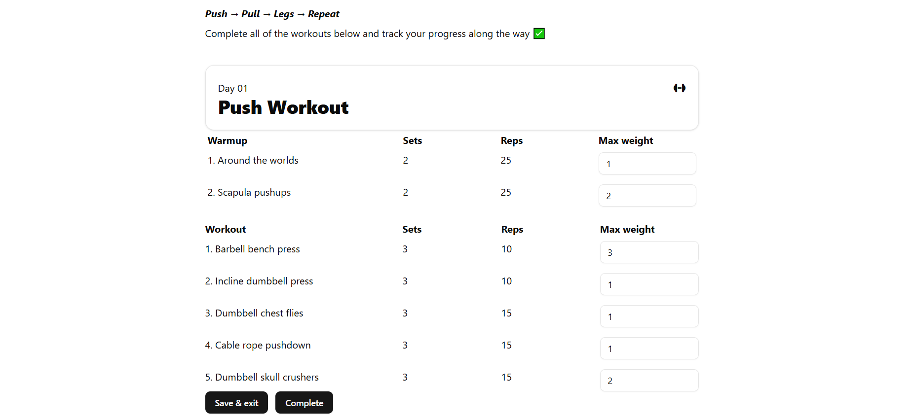

# Workout Tracker App

A simple React-based workout tracker that allows users to:

- Log max weight for warmup and workout sets.
- Persist workout data locally in the browser using `localStorage`.
- Track daily progress and mark workouts as completed.
- Switch between workout days and see tailored exercises (Push/Pull/Legs split).

## Features

- **Persistent Storage**  
  All user-entered data is stored in `localStorage` so it's never lost on refresh.

- **Day-Based Workouts**  
  Workout plans are split across days, following a Push-Pull-Legs routine.

- **Complete Workouts**  
  Mark any workout day as complete and store it locally.

- **Input Tracking**  
  Track your max weights per warmup/workout exercise with responsive inputs.

## Preview




## Built With

- **React** (with functional components and hooks)
- **TailwindCSS** and **ShadCn** for styling
- **TypeScript** for type safety
- **Custom UI Components** (`Button`, `Card`, `Input`)
- **localStorage** for state persistence

## Getting Started

### Prerequisites

Make sure you have Node.js and npm installed:

```bash
node -v
npm -v
```
